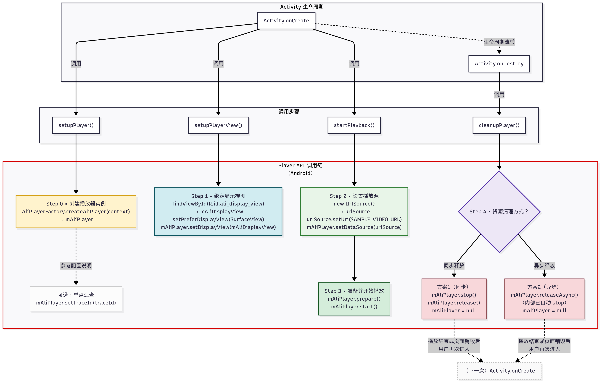

Language: 中文简体 | [English](README-EN.md)

# **API-Example (Android)**

阿里云播放器 SDK Android 示例工程

## **📖 项目简介**

本项目为阿里云播放器 SDK 的 Android 示例工程，基于 Java 编写，旨在帮助开发者快速了解并集成 SDK 提供的核心功能。

项目采用**模块化架构设计**，支持 Schema 路由跳转，具有良好的**扩展性**和**可维护性**。

## **✨ 功能特性**

### **🎯 单功能演示设计**
- **聚焦单一功能** - 每个模块仅展示一个核心功能，便于快速理解与验证。
- **极简代码实现** - 仅保留核心逻辑，去除冗余代码，提升示例可读性。
- **统一接入入口** - 支持 Schema 路由跳转，实现模块间解耦导航。

### **🔧 技术特性**
- **模块化架构** - 各功能模块独立封装，便于管理与复用。
- **无侵入路由机制** - 基于 Android Intent 实现 Schema 跳转，无需引入额外框架。
- **Material Design 风格** - 遵循 Material Design 设计规范，提升视觉一致性。
- **国际化适配** - 支持中英文自动切换，适配多语言环境。
- **配置驱动** - 支持 XML 和代码两种配置方式。

## **🏗️ 项目架构**

本项目采用模块化组织方式，结构清晰、易于扩展：

| 模块                      | 说明           | 主要功能                     | 入口文件                        |
|-------------------------| -------------- |--------------------------|-----------------------------|
| **App**                 | 主应用模块     | 应用入口、功能导航、菜单管理           | MainActivity                |
| **Common**              | 公共基础模块   | 常量定义、工具类                 | -                           |
| **BasicPlayback**       | 单功能演示模块 | 视频基础播放演示                 | BasicPlaybackActivity       |
| **BasicLiveStream**     | 单功能演示模块 | 基础直播播放演示                 | BasicLiveStreamActivity     |
| **PlaybackSurfaceView** | 单功能演示模块 | 基于 SurfaceView 的视频基础播放演示 | PlaybackSurfaceViewActivity |
| **PlaybackTextureView** | 单功能演示模块 | 基于 TextureView 视频基础播放演示  | PlaybackTextureViewActivity |
| **Downloader**          | 单功能演示模块 | 视频下载与离线播放                | DownloaderActivity          |
| **ExternalSubtitle**    | 单功能演示模块 | 使用 VttSubtitleView 加载 .vtt 字幕，支持时间轴与基础样式（如粗体、斜体），推荐用于新项目            | ExternalSubtitleActivity   |
| **ExternalSubtitle**    | 单功能演示模块 | 基于 .vtt 与 VttSubtitleView，通过 CustomStylerWebVttResolver 实现颜色、字体、位置等深度自定义           | CustomStyleExternalSubtitleActivity   |
| **FloatWindow**         | 单功能演示模块 | 悬浮窗播放                    | FloatWindowActivity         |
| **MultiResolution**     | 单功能演示模块 | 多码率/分辨率切换                | MultiResolutionActivity     |
| **PictureInPicture**    | 单功能演示模块 | 画中画播放                    | PictureInPictureActivity    |
| **Preload**             | 单功能演示模块 | 视频预加载（Direct URL/VID）    | PreloadActivity             |
| **RtsLiveStream**       | 单功能演示模块 | RTS 超低延迟直播播放             | RtsLiveStreamActivity       |
| **Thumbnail**           | 单功能演示模块 | 视频缩略图预览                  | ThumbnailActivity           |

> 📌 功能模块将根据业务和演示需求不断扩展，表格仅列举部分代表模块，更多功能请关注项目后续更新。

## **🔐 License 配置说明**

本项目未包含正式 License，请根据以下步骤完成配置以启用完整功能。

### ✅ 正式使用前配置

1. **获取并接入 License**

   请先参考 [接入 License](https://help.aliyun.com/zh/apsara-video-sdk/user-guide/access-to-license) 文档，获取已授权的播放器 SDK License，并按照指引完成接入。

2. **更新 License 信息**

   在 `App/src/main/AndroidManifest.xml` 文件中，找到如下字段并替换为你自己的 License：

```xml
<meta-data
    android:name="com.aliyun.alivc_license.licensekey"
    android:value="YOUR_LICENSE_KEY" />
<meta-data
    android:name="com.aliyun.alivc_license.licensefile"
    android:value="YOUR_LICENSE_FILE_PATH" />
```

* License Key：填写从控制台获取到的 License 密钥字符串。
* License File：填写 License 文件名称（如 license.crt），并将该 .crt 文件添加到 App/src/main/assets/cert/ 目录下。

3. **重新编译运行项目**

   完成配置后，请重新编译并运行项目，SDK 将自动加载 License 并启用完整功能。

> **⚠️ 注意**：若未正确配置 License，播放器功能将会受限或无法使用。

## **🚀 快速开始**

### **🧰 环境要求**

| 工具           | 版本要求         |
| -------------- | ---------------- |
| Android Studio | 4.0+             |
| Android SDK    | API 21+          |
| JDK            | 推荐使用 8 或 11 |

**⚠️ 注意**：当前项目的 Gradle 版本**不兼容 JDK 17 及以上版本**。

如已安装 JDK 17、21、23 等较高版本，请手动切换为 JDK 8 或 11 后再进行构建。

> **JDK 11 设置方法**：
>
> 打开 Android Studio，进入 `Settings`（或 `Preferences`）→ `Build, Execution, Deployment` → `Build Tools` → `Gradle` → `Gradle JDK`，选择 11（如果没有 11，请先升级 Android Studio）。

### **📦 编译运行**

1. **下载项目**

   ```bash
   git clone [your-repo-url]
   cd API-Example
   ```

2. **导入项目**
   - 打开 Android Studio
   - 选择 `File` → `Open`
   - 选择项目根目录并打开

3. **同步项目**
   - Android Studio 会自动提示同步 Gradle
   - 点击 `Sync Now` 等待同步完成

4. **连接设备并运行**
   
   - 使用 USB 连接 **Android 真机设备**，并确保已开启开发者模式与 USB 调试权限

   - 点击工具栏的 `Run` 按钮 (绿色三角形)
   - 选择目标设备并等待应用安装运行

### **🧪 验证结果**
应用启动后将进入主功能菜单页面，点击任意功能项即可跳转至对应的播放演示页面。

## **📌 快速接入**

下图展示了播放器 SDK 的几大接入步骤，助您快速实现视频起播：



> 更多详情请参考官网《快速开始》文档：[Android 播放器快速开始](https://help.aliyun.com/zh/vod/developer-reference/android-player-quick-start)

💡 **提示**：如果您希望以更低的代码成本快速接入播放器，**推荐使用 AliPlayerKit**。请访问 [GitHub 仓库](https://github.com/aliyun/PlayerKit-Android) 获取源码，并结合 [在线文档](https://aliyun.github.io/PlayerKit-Android/) 完成接入。
