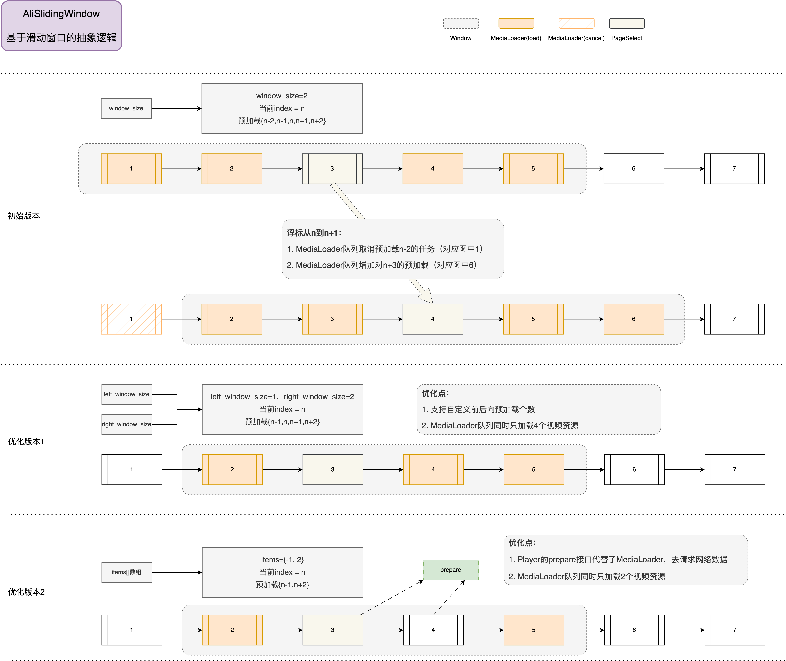

# **核心能力**

本组件功能使用阿里云播放器SDK，通过多个播放器实例（AliPlayer）+ 预加载（MediaLoader）+ 预渲染的方式进行实现，使用了预加载、预渲染、HTTPDNS、加密播放等核心能力，在播放延迟、播放稳定性及安全性方面大幅度提升观看体验。具体介绍参考[进阶功能](https://help.aliyun.com/zh/vod/developer-reference/advanced-features)。

## **预加载**

通过滑动窗口策略动态的启停视频预加载任务，SDK底层基于网络状态智能的调整任务优先级，以确保当前正在播放的视频和即将要播放的视频可以获得更多的网络资源，可以显著的提升视频的秒开率，降低卡顿率。即使在快速滑动视频时，仍然可以获得流畅的播放体验。



**参考文档**：[预加载](https://help.aliyun.com/zh/vod/developer-reference/advanced-features#p-onu-t80-xxq)

## **预渲染**

使用预渲染的方式，在后台提前渲染后续视频的首帧，减少黑屏的出现，可以让播放更加丝滑。

音视频终端 SDK 和播放器 SDK 从 6.16.0 版本开始支持预渲染能力。

```java
// Allow pre-render to avoid black screen when sliding to the next item
aliPlayer.setOption(IPlayer.ALLOW_PRE_RENDER, 1);
```

## **多实例播放器池**

实现了全局共享的播放器实例池，可以方便的配置实例数。通过优化 API 调用和线程资源管理，以确保在线程数、CPU、内存等方面达到性能最优、资源最省，在性能和体验上达到最佳的平衡。通过性能优化，减少了滑动过程中的耗时操作，减少滑动卡顿，让播放体验更加丝滑。


## **HTTPDNS**

HTTPDNS 可以提供更快速和稳定的 DNS 解析服务，通过替换传统 DNS 解析，可以减少 DNS 解析时间，提高视频播放的加载速度和稳定性，从而提升用户的观看体验。

音视频终端 SDK 和播放器 SDK 从 6.12.0 版本开始无需手动开启 HTTPDNS。

**参考文档**：[HTTPDNS](https://help.aliyun.com/zh/vod/developer-reference/advanced-features#f7cd7ff07ee0b)

## **视频加密**

音视频终端 SDK 和播放器 SDK 从 6.8.0 版本开始支持 MP4 私有加密播放能力。

- 经私有加密的 MP4 格式视频，需满足以下条件，才可正常播放：
  - 经私有加密的 MP4 视频传给播放器播放时，业务侧（App侧）需要为视频URL追加`etavirp_nuyila=1`
  - App 的 License 对应的 uid 与产生私有加密MP4的 uid 是一致的
- 校验加密视频是否正确，以私有加密的视频 URL 为例：
  - meta 信息里面带有 `AliyunPrivateKeyUri` 的tag
  - ffplay 不能直接播放

**参考文档**：[播放加密视频](https://help.aliyun.com/zh/vod/developer-reference/play-an-encrypted-video)

## **H265自适应播放**

当播放 H265 流硬解失败且已设置 H264 备流时，实现自动降级播放 H264 备流；若未设置 H264 备流，则自动降级为 H265 软解播放。

**参考文档**：[H265自适应播放](https://help.aliyun.com/zh/vod/developer-reference/advanced-features#522d9aa1cb4z3)

## **自适应ABR**

播放器 SDK 支持多码率自适应 HLS、DASH 视频流，通过调用播放器的 `selectTrack` 方法切换播放的码流，可以实现网络自适应切换视频清晰度的功能。

**参考文档**：[网络自适应切换视频清晰度](https://help.aliyun.com/zh/vod/developer-reference/advanced-features#p-kfm-7bv-9el)

## **其它功能**

- **防录屏**

  防录屏通过监听录屏和截屏行为及时阻断播放进程，有效保护视频内容的版权，防止未经授权的盗录和传播。