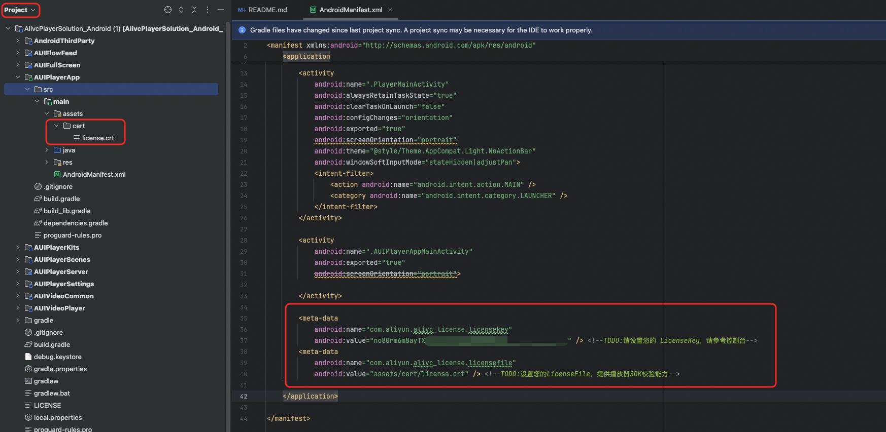

# **集成准备**

下面介绍 **AUIShortVideoList** 组件的集成方法，帮助您快速将其整合到项目中。

## **⚠️说明**

为实现完整的全链路短剧解决方案，AUIShortVideoList 组件需与我们提供的 [VodAppServer](https://github.com/MediaBox-Demos/VodAppServer)（基于 Spring Boot 的阿里云视频点播 VOD 短剧管理平台后端服务）配套使用。VodAppServer 提供短剧内容管理、播放地址分发、鉴权控制等关键能力。

客户端与服务端的协同能够构建覆盖内容管理、分发到播放的完整全链路能力，使您无需自建后台即可快速搭建可运营的短剧业务体系，从而显著缩短上线周期、降低研发成本，并确保内容运营与播放体验在前后端之间高效一致。

## **前置条件**

您已获取音视频终端 SDK 的播放器的 License 授权和 License Key。获取方法，请参见[申请License](https://help.aliyun.com/zh/apsara-video-sdk/user-guide/license-authorization-and-management#13133fa053843)。

1. 将License文件复制到Android Studio项目中的assets目录下。

> **说明** 需要将您在控制台下载的 License 文件存放至项目中的 main 目录中的 assets 目录下，确保您的 `com.aliyun.alivc_license.licensefile` 所对应的 value 和 License 文件路径保持一致。

2. 在 `AndroidManifest.xml` 文件中添加以下 `<meta-data>` 节点。

> **重要** `<meta-data>`节点的配置位置如下，若配置License后校验失败，您可以检查`<meta-data>`节点是否处于`<application>`元素下面，且`<meta-data>`的name是否正确。



```xml
<meta-data
   android:name="com.aliyun.alivc_license.licensekey"
   android:value="no80rm6m8ayTXNTk80637a6cdef2a4825****************" /> <!--TODO:请设置您的 LicenseKey，请参考控制台-->
<meta-data
   android:name="com.aliyun.alivc_license.licensefile"
   android:value="assets/cert/license.crt" /> <!--TODO:设置您的LicenseFile，提供播放器SDK校验能力-->
```

## **集成步骤**

1. 接入已授权播放器的音视频终端 SDK License。

   具体操作请参见[Android端接入License](https://help.aliyun.com/zh/apsara-video-sdk/user-guide/access-to-license#58bdccc0537vx)。

2. 将 AUIShortVideoList 模块拷贝到您项目工程中。

3. 在项目 gradle 文件的 repositories 配置中，引入阿里云 SDK 的 Maven 源：

   如果您使用 Groovy DSL，请在项目根目录的 settings.gradle 文件中添加以下内容：

   ```groovy
   repositories {
       // aliyun maven
       maven { url "https://maven.aliyun.com/repository/releases" }
   }
   ```
   
   如果您使用 Kotlin DSL，请在项目根目录的 settings.gradle.kts 文件中添加以下内容：
   
   ```kotlin
   repositories {
       // aliyun maven
       maven("https://maven.aliyun.com/repository/releases")
   }
   ```

4. 增加模块引用方式和依赖方式。

   * 添加模块引用

   如果您使用 Groovy DSL，请在项目根目录的 settings.gradle 文件中添加以下内容：

   ```groovy
   // 若 AUIShortVideoList 模块位于 AUIPlayerKits 文件夹中：
   include ':AUIPlayerKits:AUIShortVideoList'
   // 若 AUIShortVideoList 模块直接放在项目根目录：
   include ':AUIShortVideoList'
   ```

   如果您使用 Kotlin DSL，请在项目根目录的 settings.gradle.kts 文件中添加以下内容：

   ```kotlin
   // 若 AUIShortVideoList 模块位于 AUIPlayerKits 文件夹中：
   include(":AUIPlayerKits:AUIShortVideoList")
   // 若 AUIShortVideoList 模块直接放在项目根目录：
   include(":AUIShortVideoList")
   ```

   * 添加模块依赖

   如果您使用 Groovy DSL，请在 app 模块的 build.gradle 文件中添加以下内容：

   ```groovy
   // 若 AUIShortVideoList 模块位于 AUIPlayerKits 文件夹中：
   implementation project(':AUIPlayerKits:AUIShortVideoList')
   // 若 AUIShortVideoList 模块直接放在项目根目录：
   implementation project(':AUIShortVideoList')
   ```

   如果您使用 Kotlin DSL，请在 app 模块的 build.gradle.kts 文件中添加以下内容：

   ```kotlin
   // 若 AUIShortVideoList 模块位于 AUIPlayerKits 文件夹中：
   implementation(project(":AUIPlayerKits:AUIShortVideoList"))
   // 若 AUIShortVideoList 模块直接放在项目根目录：
   implementation(project(":AUIShortVideoList"))
   ```

5. 编译运行，确保组件已被正确集成。

> **建议**：集成完成后，建议执行一次 `git commit` ，提交记录当前组件的最新 commit ID。这为将来的组件更新提供重要的追溯依据，也记录了组件更新前后的代码差异，有效把控集成准入质量。同时还可以在寻求技术支持时快速定位组件版本，从而提高技术支持的效率。

## **集成FAQ**

1. 如未配置正确的 SDK License，集成完毕后，会出现播放黑屏等异常问题。

2. 请确保 AUIShortVideoList 模块的配置（如 compileSdkVersion、buildToolsVersion、minSdkVersion、targetSdkVersion 等）与您的项目中的设置保持一致

3. 如果您的项目中已有相同第三方库，请调整 AUIShortVideoList 模块中的版本号，以确保兼容性并避免冲突。

4. Android 播放器 SDK 不支持模拟器，集成完成后需在真机上测试。

5. 如果遇到 Namespace 相关的错误，请检查您的 AGP 版本：当 AGP 版本高于 8（如 8.3.2），请在各模块的 build.gradle 中手动添加 namespace 设置；当 AGP 版本低于 7（如 4.0.1），请在各模块的 build.gradle 中移除 namespace 设置。请确保 namespace 设置与各模块 AndroidManifest.xml 中的 package 属性保持一致。

6. Gradle 在处理 repository 的优先级时出现冲突

   请优先在 settings.gradle 中添加 repository。