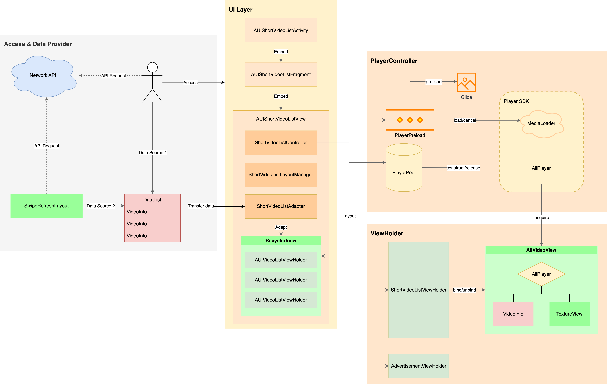

# **AUIShortVideoList**

## **一、组件介绍**

**AUIShortVideoList** 模块使用多个播放器实例（AliPlayer）+ 预加载（MediaLoader）+ 预渲染的方式实现短视频列表播放，结合本地缓存可以达到极致全屏秒开体验。

## **二、模块说明**

### **目录结构**

```html
.
└── shortvideolist	# 根目录
    ├── AUIShortVideoListActivity.java	# 短视频列表播放Activity页面
    ├── AUIShortVideoListConstants.java	# 短视频列表播放-常量管理类
    ├── AUIShortVideoListFragment.java	# 短视频列表播放Fragment页面
    ├── AUIShortVideoListView.java	# 短视频列表播放View组件
    ├── business	# 短视频列表播放业务模块
    │   ├── floatinglayer	# 进度浮层
    │   ├── playspeed	# 倍速播放
    │   └── trackinfo	# 多视频轨播放（可变清晰度）
    ├── component	# 短视频列表播放View组件
    ├── controller	# 短视频列表播放控制器
    │   ├── AUIShortVideoListController.java	# 短视频列表播放页面控制器
    │   ├── player
    │   │   ├── AliPlayerPool.java	# 多实例播放器池
    │   │   └── AliVideoView.java	# 视频渲染与播放组件
    │   └── preload
    │       ├── AliPlayerPreload.java	# 预加载器
    │       └── AliSlidingWindow.java	# 滑动窗口抽象类
    ├── data	# 短视频列表播放数据结构
    ├── listener	# 短视频列表播放监听回调
    ├── skeleton	# 短视频列表播放骨架
    ├── utils	# 短视频列表播放工具类
    └── viewmodel	# 短视频列表播放ViewModel
```

### **逻辑架构**



## **三、集成准备**

参考 [集成准备](./Integration.md)

## **四、快速开始**

参考 [快速开始](./QuickStart.md)

## **五、核心能力**

参考 [核心能力](./CoreFeatures.md)

## 六、用户指引

### **文档**

[播放器SDK](https://help.aliyun.com/zh/vod/developer-reference/apsaravideo-player-sdk/)

[音视频终端SDK](https://help.aliyun.com/product/261167.html)

[阿里云·视频点播](https://www.aliyun.com/product/vod)

[视频点播控制台](https://vod.console.aliyun.com)

[ApsaraVideo VOD](https://www.alibabacloud.com/zh/product/apsaravideo-for-vod)


### **FAQ**

[播放异常自主排查](https://help.aliyun.com/zh/vod/developer-reference/troubleshoot-playback-errors)

