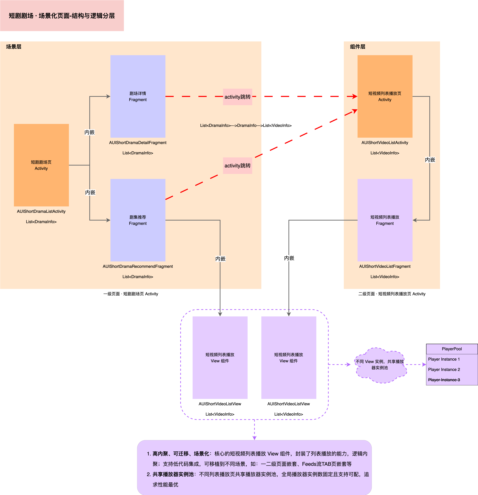

# **AUIShortPlaylistTheater**

## **一、场景介绍**

**AUIShortPlaylistTheater** 模块是短剧剧场场景化模块，基于 **AUIShortVideoList**
组件实现。该模块提供剧场详情页和剧场推荐页，支持一二级页面嵌套和播放器实例共享。

## **二、场景说明**



## **三、场景集成**

### **集成准备**

在进行短剧剧场场景搭建之前，请确保已完成 **AUIShortVideoList** 组件的集成准备。

### **集成步骤**

1. 将 AUIShortPlaylistTheater 模块拷贝到您项目工程中。
2. 检查 AUIShortVideoList 组件的依赖关系，并增加模块引用方式和依赖方式。

* 检查组件依赖

请在 AUIShortPlaylistTheater 模块的 build.gradle 文件中检查 AUIShortVideoList 组件的依赖配置：

```groovy
// 若 AUIShortVideoList 模块位于 AUIPlayerKits 文件夹中：
implementation project(':AUIPlayerKits:AUIShortVideoList')
// 若 AUIShortVideoList 模块直接放在项目根目录：
implementation project(':AUIShortVideoList')
```

* 添加模块引用

如果您使用 Groovy DSL，请在项目根目录的 settings.gradle 文件中添加以下内容：

```groovy
// 若 AUIShortPlaylistTheater 模块位于 AUIPlayerScenes 文件夹中：
include ':AUIPlayerScenes:AUIShortPlaylistTheater'
// 若 AUIShortPlaylistTheater 模块直接放在项目根目录：
include ':AUIShortPlaylistTheater'
```

如果您使用 Kotlin DSL，请在项目根目录的 settings.gradle.kts 文件中添加以下内容：

```kotlin
// 若 AUIShortPlaylistTheater 模块位于 AUIPlayerScenes 文件夹中：
include(":AUIPlayerScenes:AUIShortPlaylistTheater")
// 若 AUIShortPlaylistTheater 模块直接放在项目根目录：
include(":AUIShortPlaylistTheater")
```

* 添加模块依赖

如果您使用 Groovy DSL，请在 app 模块的 build.gradle 文件中添加以下内容：

```groovy
// 若 AUIShortPlaylistTheater 模块位于 AUIPlayerScenes 文件夹中：
implementation project(':AUIPlayerScenes:AUIShortPlaylistTheater')
// 若 AUIShortPlaylistTheater 模块直接放在项目根目录：
implementation project(':AUIShortPlaylistTheater')
```

如果您使用 Kotlin DSL，请在 app 模块的 build.gradle.kts 文件中添加以下内容：

```kotlin
// 若 AUIShortPlaylistTheater 模块位于 AUIPlayerScenes 文件夹中：
implementation(project(":AUIPlayerScenes:AUIShortPlaylistTheater"))
// 若 AUIShortPlaylistTheater 模块直接放在项目根目录：
implementation(project(":AUIShortPlaylistTheater"))
```

4. 编译运行，确保组件已被正确集成。

## **四、快速开始**

### **使用方法**

您可以将短剧剧场 Activity 页面直接提供给外部进行跳转。以下是不同语言的实现示例：

Java 示例：

```java 
// TODO: context is android context
Intent intent = new Intent(context, AUIShortPlaylistActivity.class);

startActivity(intent);
```

Kotlin 示例：

```kotlin
// TODO: context is android context
val intent = Intent(context, AUIShortPlaylistActivity::class.java)
startActivity(intent)
```

### **获取数据**

AUIShortPlaylistTheater 模块使用的数据结构为 `List<PlaylistInfo>`，其中 `PlaylistInfo`
为存储短剧剧集的数据类，其数据结构如下：

| 字段                  | 类型        | 释义       | 备注                  |
|---------------------|-----------|----------|---------------------|
| playlistId          | String    | 剧集唯一id   | 用于唯一标识一个短剧资源        |
| playlistName        | String    | 剧集名称     | 用于在 UI 中展示短剧的正式名称   |
| playlistDescription | String    | 剧集列表描述   | 用于在 UI 中展示列表的描述信息   |
| playlistStatus      | String    | 列表状态     | 用于处理列表的状态           |
| playlistTags        | String    | 列表标签     | 用于在 UI 中展示不同列表的标签信息 |
| playlistCoverUrl    | String    | 剧集封面图片   | 用于在列表或详情页展示短剧的封面图   |
| playlistOrderBy     | String    | 排序规则     | asc（默认升序） desc 降序   |
| playlistExtension   | String    | 列表拓展项    | 用户自定义，可以为null       |
| createTime          | String    | 列表创建时间   | 创建时自动生成             |
| modifyTime          | String    | 列表最后修改时间 | 修改时自动生成             |
| requestId           | String    | 本次接口请求id | 可用于该次接口问题排查         |
| playlistVideos      | VideoInfo | 视频信息列表   | 该播放列表包含的视频列表        |

您可以通过网络请求或数据转换这两种方式，获取最终的 `List<PlaylistInfo>` 数据源：

* 网络请求

Java 示例：

```java
AUIShortPlaylistUtil.requestPlaylistInfoList(requestParams, new AUIShortVideoListUtil.OnNetworkCallBack<List<PlaylistInfo>>() {
    @Override
    public void onResponse (List <PlaylistInfo> playlist) {
        if (PlaylistInfoList == null || PlaylistInfoList.isEmpty()) {
            // TODO: Request playlist info list error!
            return;
        }
        // TODO: Use PlaylistInfoList
    }
});
```

Kotlin 示例：

```kotlin
AUIShortPlaylistListUtil.requestPlaylistInfoList(object :
    AUIShortVideoListUtil.OnNetworkCallBack<List<PlaylistInfo?>?> {
    override fun onResponse(playlist: List<PlaylistInfo?>?) {
        if (playlist.isNullOrEmpty()) {
            // TODO: Request playlist info list error!
            return
        }
        // TODO: Use PlaylistInfoList
    }
})
```

* 数据转换

Java 示例：

```java
ArrayList<PlaylistInfo> playlist = AUIShortPlaylistListUtil.assemblePlayListInfoList();
if(playlist ==null || PlaylistInfoList.isEmpty()) {
    // TODO: Assemble playlist info list error!
    return;
}
// TODO: Use PlaylistInfoList
```

Kotlin 示例：

```kotlin
val playlist = AUIShortPlaylistListUtil.assemblePlayListInfoList()
if (playlist.isNullOrEmpty()) {
    // TODO: Assemble playlist info list error!
    return
}
// TODO: Use PlaylistInfoList
```

